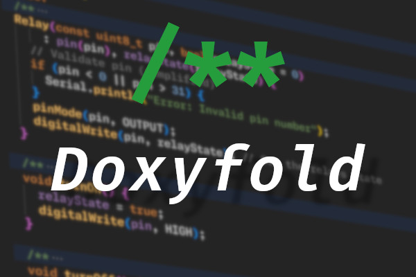

# DoxyFold (vscode)

A VSCode plugin that automatically folds Doxygen comments for multiple programming languages.

## Overview
This plugin was inspired by an idea while working on [Phytolabs](https://github.com/Deen-Weible/PhytoLabs), I decided to expirimant with Grok to generate most of  the code as I didn't want to take time away from my more valuable projects and I wanted to see how far ai has come. It successfully implements automatic folding of Doxygen-style comments in supported languages.

## Features
- Supports:
  - C++
  - Java
  - Python
- Easy to extend

## Why only github?
The reason this addon is only (officially) published on github. I'm having issues with Azure Devops (whoda thunk it) and my Eclipse account for open-vsx. If I figure it out I'll cross-publish

## License
This plugin is released under the [GPLv3](https://www.gnu.org/licenses/gpl-3.0) license.

## Contributing
To contribute either
- Create a pull request with your changes
- Submit an issue if you have any questions or suggestions/

## Potential PR notes
Adding new language support is very easy and defined in package.json, as long as the Doxygen regex remains the same.